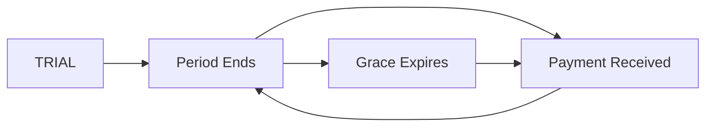

# PayChangu Billing — STEP 3 Complete: Subscription Lifecycle

**Date:** 2026-01-03
**Status:** ✅ STEP 3 Complete — Subscription Lifecycle + Scheduled Tasks

---

## Summary

Implemented automatic subscription lifecycle management with:
- ✅ Centralized domain service functions for state transitions
- ✅ `refresh_subscription_status()` — Canonical status normalization
- ✅ `process_subscription_renewals()` — Bulk processing for all subscriptions
- ✅ Management command: `python manage.py process_subscriptions`
- ✅ Celery task: `process_subscription_renewals` (for automated scheduling)
- ✅ 14 comprehensive tests (all passing)

**Total Tests:** 55 passing (15 webhooks + 12 PaymentEvent + 14 Invoice + 14 Lifecycle)

---

## What Was Implemented

### 1. Domain Service Functions

**File:** `billing/domain.py` (lines 155-345)

#### `refresh_subscription_status(subscription)` → BusinessSubscription

**Purpose:** Canonical function to normalize subscription status based on current time and dates.

**State Transitions:**
```
TRIAL → PAST_DUE (when trial_end passes)
ACTIVE → PAST_DUE (when current_period_end passes)
PAST_DUE → SUSPENDED (when grace period expires)
```

**Features:**
- ✅ Skips terminal states (SUSPENDED, CANCELED, EXPIRED)
- ✅ Respects `settings.BILLING_GRACE_DAYS` (default 7 days)
- ✅ Logs all transitions
- ✅ Idempotent (safe to call multiple times)

**Example:**
```python
from billing import domain

# Normalize subscription status
domain.refresh_subscription_status(subscription)
```

---

#### `process_subscription_renewals()` → Dict[str, Any]

**Purpose:** Bulk process all non-terminal subscriptions for status transitions.

**Returns:**
```python
{
    "total_checked": 42,       # Number of subscriptions checked
    "expired_trials": 3,        # TRIAL → PAST_DUE transitions
    "expired_periods": 5,       # ACTIVE → PAST_DUE transitions
    "suspended": 2,             # PAST_DUE → SUSPENDED transitions
    "errors": 0,                # Processing errors
}
```

**Features:**
- ✅ Processes all TRIAL/ACTIVE/PAST_DUE subscriptions
- ✅ Skips terminal states (SUSPENDED/CANCELED/EXPIRED)
- ✅ Error handling with logging
- ✅ Returns statistics for monitoring

**Example:**
```python
from billing import domain

# Process all subscriptions
stats = domain.process_subscription_renewals()
print(f"Processed {stats['total_checked']}, suspended {stats['suspended']}")
```

---

### 2. Management Command

**File:** `billing/management/commands/process_subscriptions.py`

**Usage:**
```bash
# Dry run (preview changes without applying)
python manage.py process_subscriptions --dry-run

# Real processing
python manage.py process_subscriptions
```

**Dry Run Output:**
```
DRY RUN MODE — No changes will be made
Starting subscription processing at 2026-01-03 13:55:03
Would process:
  - 1 trial expiries
  - 0 period expiries
  - 0 grace period expiries (suspend)
```

**Real Run Output:**
```
Starting subscription processing at 2026-01-03 14:00:00
Subscription processing complete:
  - 42 subscriptions checked
  - 3 trials expired
  - 5 periods expired
  - 2 subscriptions suspended
  - 0 errors
```

**Features:**
- ✅ Dry-run mode for testing
- ✅ Colored output (success/warning/error)
- ✅ Detailed statistics
- ✅ Error reporting

---

### 3. Celery Task

**File:** `billing/tasks.py` (lines 43-67)

**Task:** `process_subscription_renewals()`

**Purpose:** Automated subscription processing via Celery Beat.

**Configuration Required:**

Add to your `celery.py` or Celery Beat schedule:

```python
from celery.schedules import crontab

app.conf.beat_schedule = {
    'process-subscription-renewals': {
        'task': 'billing.tasks.process_subscription_renewals',
        'schedule': crontab(hour=1, minute=0),  # Daily at 1:00 AM
    },
}
```

**OR** use Django Celery Beat with database scheduling:

```python
from django_celery_beat.models import PeriodicTask, CrontabSchedule

# Create schedule: Daily at 1:00 AM
schedule, _ = CrontabSchedule.objects.get_or_create(
    hour=1,
    minute=0,
    day_of_week='*',
    day_of_month='*',
    month_of_year='*',
)

# Create periodic task
PeriodicTask.objects.get_or_create(
    name='Process Subscription Renewals',
    defaults={
        'task': 'billing.tasks.process_subscription_renewals',
        'crontab': schedule,
        'enabled': True,
    }
)
```

**Returns:**
```python
{
    "total_checked": 42,
    "expired_trials": 3,
    "expired_periods": 5,
    "suspended": 2,
    "errors": 0,
}
```

---

### 4. Subscription State Machine

**States:**
- `TRIALING/TRIAL` — In trial period (before trial_end)
- `ACTIVE` — Paid and current (before current_period_end)
- `PAST_DUE` — Payment due but within grace period
- `SUSPENDED` — Access blocked after grace period
- `CANCELED` — Manually cancelled
- `EXPIRED` — Terminal state (legacy)

**Transitions:**



**Grace Period:**
- Default: 7 days (configurable via `settings.BILLING_GRACE_DAYS`)
- Starts from: `next_billing_date` or `current_period_end` or `trial_end`
- During grace: User retains access (middleware allows)
- After grace: User is SUSPENDED (middleware blocks)

---

## Test Coverage

### New Tests

**File:** `billing/tests/test_subscription_lifecycle.py` (14 tests)

**TestSubscriptionLifecycle** (8 tests):
- ✅ `test_activate_subscription` — Activation logic
- ✅ `test_mark_past_due` — Marking past due
- ✅ `test_suspend_subscription` — Suspension with reason
- ✅ `test_refresh_status_trial_expired` — TRIAL → PAST_DUE
- ✅ `test_refresh_status_period_expired` — ACTIVE → PAST_DUE
- ✅ `test_refresh_status_grace_expired` — PAST_DUE → SUSPENDED
- ✅ `test_refresh_status_within_grace` — Grace period protection
- ✅ `test_refresh_status_skips_terminal_states` — Terminal state protection

**TestProcessSubscriptionRenewals** (2 tests):
- ✅ `test_process_subscription_renewals` — Bulk processing with multiple states
- ✅ `test_process_subscription_renewals_empty` — Graceful empty handling

**TestActivateSubscriptionWithPaymentMethod** (4 tests):
- ✅ `test_activate_with_airtel` — Airtel Money activation
- ✅ `test_activate_with_tnm` — TNM Mpamba activation
- ✅ `test_activate_with_card` — Card activation
- ✅ `test_activate_with_unknown_method` — Unknown method fallback

---

## Files Changed/Created

### New Files
- ✅ `billing/management/commands/process_subscriptions.py` (104 lines) — Management command
- ✅ `billing/tests/test_subscription_lifecycle.py` (335 lines) — Lifecycle tests
- ✅ `docs/BILLING_STEP_3_SUBSCRIPTION_LIFECYCLE_COMPLETE.md` — This document

### Modified Files
- ✅ `billing/domain.py` — Added `refresh_subscription_status()` and `process_subscription_renewals()`
- ✅ `billing/tasks.py` — Added `process_subscription_renewals()` Celery task

---

## Deployment Instructions

### 1. Run Management Command Manually (Test)

```bash
# Test with dry-run first
python manage.py process_subscriptions --dry-run

# Run for real
python manage.py process_subscriptions
```

### 2. Set Up Cron Job (If Not Using Celery)

Add to crontab:
```bash
# Run daily at 1:00 AM (Africa/Blantyre timezone)
0 1 * * * cd /path/to/circuitcity_clean && python manage.py process_subscriptions >> /var/log/subscription_renewals.log 2>&1
```

### 3. Set Up Celery Beat (Recommended)

**Option A: Programmatic Schedule** (in `celery.py`):
```python
from celery.schedules import crontab

app.conf.beat_schedule = {
    'process-subscription-renewals': {
        'task': 'billing.tasks.process_subscription_renewals',
        'schedule': crontab(hour=1, minute=0),  # Daily at 1:00 AM
    },
}
```

**Option B: Django Celery Beat** (database-driven):
```bash
pip install django-celery-beat

# Add to INSTALLED_APPS
INSTALLED_APPS = [
    ...
    'django_celery_beat',
]

# Migrate
python manage.py migrate django_celery_beat

# Create schedule via Django admin or shell
```

**Start Celery Beat:**
```bash
celery -A cc beat --loglevel=info
```

---

## Monitoring & Alerting

### Logging

All lifecycle transitions are logged with structured data:

```python
INFO billing.domain: Subscription trial expired: business=abc-123, trial_end=2026-01-03
INFO billing.domain: Subscription period expired: business=def-456, current_period_end=2026-01-02
WARNING billing.domain: Subscription SUSPENDED: business=ghi-789, reason=Grace period expired (7 days after 2025-12-27)
INFO billing.domain: Subscription status changed: business=abc-123, trial → past_due
```

### Statistics Tracking

The `process_subscription_renewals()` function returns statistics that can be sent to monitoring systems:

```python
from billing.tasks import process_subscription_renewals

result = process_subscription_renewals.apply()
stats = result.get()

# Send to monitoring (Sentry, DataDog, etc.)
if stats['errors'] > 0:
    alert_ops(f"Subscription processing had {stats['errors']} errors")

if stats['suspended'] > 10:
    alert_sales(f"{stats['suspended']} subscriptions suspended today")
```

---

## Configuration Options

### Grace Period

**Setting:** `BILLING_GRACE_DAYS`
**Default:** 7 days
**Location:** `settings.py`

```python
# settings.py
BILLING_GRACE_DAYS = 7  # Allow 7 days after period end before suspending
```

### Trial Period

**Setting:** `BILLING_TRIAL_DAYS`
**Default:** 30 days
**Location:** `settings.py`

```python
# settings.py
BILLING_TRIAL_DAYS = 30  # New businesses get 30-day trial
```

---

## Middleware Integration

The existing `SubscriptionGateMiddleware` (`billing/middleware.py`) already integrates with the lifecycle system:

**Access Rules:**
- ✅ TRIAL (not expired) → Allow
- ✅ ACTIVE → Allow
- ✅ PAST_DUE (within grace) → Allow
- ❌ SUSPENDED → Block (redirect to `/billing/trial-expired/`)
- ❌ EXPIRED → Block
- ❌ CANCELED → Block

The middleware checks:
1. `subscription.is_active_now()` — Returns True for TRIAL/ACTIVE/GRACE
2. `subscription.in_grace()` — Returns True if within grace period
3. `subscription.is_expired()` — Returns True if past grace

**These methods now align with the domain service transitions.**

---

## Next Steps (STEP 4)

Now that subscriptions auto-expire and suspend, users need to:
1. See invoices
2. Download invoices as PDF
3. Receive invoice emails

**STEP 4 will implement:**
- Invoice PDF generation (ReportLab)
- Download endpoint + UI
- Invoice list page

---

## Acceptance Criteria ✅

**STEP 3 Requirements:**
- [x] Centralized domain service for state transitions
- [x] `refresh_subscription_status()` function
- [x] `process_subscription_renewals()` function
- [x] Management command for manual processing
- [x] Celery task for automated scheduling
- [x] Dry-run mode for testing
- [x] Comprehensive logging
- [x] Statistics tracking
- [x] Respects grace period
- [x] Skips terminal states
- [x] Error handling
- [x] 14 lifecycle tests (all passing)
- [x] All existing tests still pass (55 total)

---

**Status:** ✅ Ready for STEP 4 (Invoice PDF Generation)
